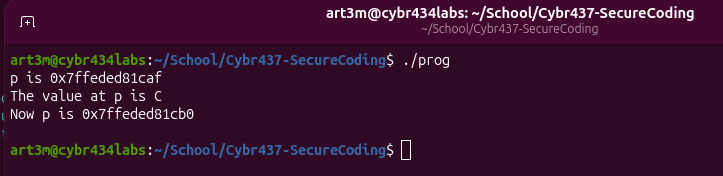
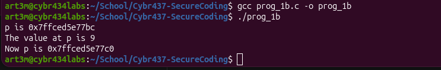
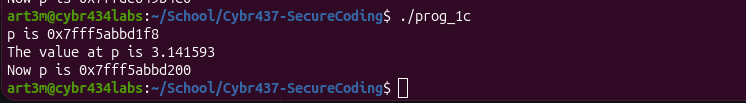

# CYBR437 - Secure Coding 
# Lab 1

**Name:** Artem Peychev
**Name:** September 24th, 2026

### Questions

## Question 1a: Execute the program and explain the output

The output of this program contains three lines.

Line 1: p stores the address of c, so printing out p prints out that address.

Line 2: When printing out *p it basically means go to the address stored in p and get the value which prints out the character 'C'.

Line 3: This line demonstrates arithmetic with pointers, p = p + 1, which takes the memory address stored in p and adds 1 byte to it and assigns that new value to p which prints out the new address

## Question 1b: Modify the code to perform the same pointer arithmetic on a pointer to an int. Execute the program and explain the output.

Line 1: p points to the memory address of variable called nine (which contains integer 9 as its value) outputs that memory address

Line 2: here I am printing out *p which basically says take the memory address that p points to and take that value printing out an integer 9. 

Line 3: prints out p = p + 1, which means:

new address = old address + (1 x size of pointed to type)

Which in this case the pointed type is an int and an int takes 4 bytes, therefore, it adds four bytes to the current memory address for p.

## Question 1c: Modify the code again to perform the same pointer arithmetic on a pointer to a double. Execute the program and explain the output.

Line 1:

Line 2:

Line 3: