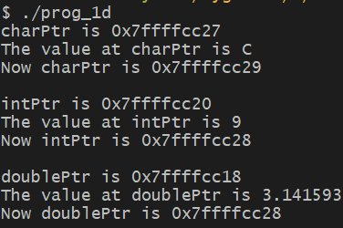
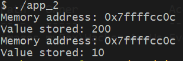
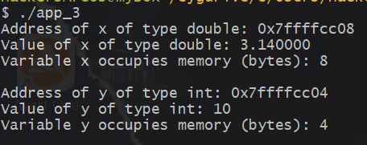
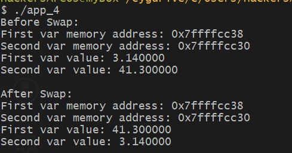

***

**Name:** Artem Peychev  
**CYBR437:** Secure Coding  
**Assignment:** Lab 1  
**Due Date:** September 30th, 2026  

***

##### Note to self: Common C Type Sizes:  
*char:  1 byte*  
*int:   4 bytes*   
*float: 4 bytes*  
*double:8 bytes*  
*** 

## Question 1a: Execute the program and explain the output


```bash
#include <stdio.h>

int main() {

	char c = 'C'; 
	char *p = &c; 


	// p: memory address of c
	printf("p is %p\n", p); 
	// *p: the value stored at the memory address in p
	// since memory address of p is c this ultimately means
	// go to memory address of c and read its value 
	printf("The value at p is %c\n", *p); 

	// Pointer arithmetic
	// take the memory address that p points to which is c
	// and add one to it
	p = p + 1;
	printf("Now p is %p\n\n", p);

}

```


The output of this program contains three lines.

Line 1: p stores the address of c, so printing out p prints out that address.

Line 2: When printing out *p it basically means go to the address stored in p and get the value which prints out the character 'C'.

Line 3: This line demonstrates arithmetic with pointers, p = p + 1, which takes the memory address stored in p and adds 1 byte to it and assigns that new value to p which prints out the new address


## Question 1b: Modify the code to perform the same pointer arithmetic on a pointer to an int. Execute the program and explain the output.


```bash
#include <stdio.h>

int main() {

	int nine = 9; 
	int *p = &nine; 


	// p: memory address of nine
	printf("p is %p\n", (void *)p); 
	// *p: mem address p points to and take that value
	printf("The value at p is %d\n", *p); 

	// Pointer arithmetic
	// take the memory address that p points to which is c


	// this adds 1 int to the memory address
	// since int = 4 bytes 
	// adds 4 bytes to the memory address
	p = p + 1;
	printf("Now p is %p\n", (void *)p);

}
```


Line 1: p points to the memory address of variable called nine (which contains integer 9 as its value) outputs that memory address

Line 2: here I am printing out *p which basically says take the memory address that p points to and take that value printing out an integer 9. 

Line 3: prints out p = p + 1, which means:

new address = old address + (1 x size of pointed to type)

Which in this case the pointed type is an int and an int takes 4 bytes, therefore, it adds four bytes to the current memory address for p.

## Question 1c: Modify the code again to perform the same pointer arithmetic on a pointer to a double. Execute the program and explain the output.


```bash
#include <stdio.h>

int main() {

	// pi to 8 decimal points
	double pi = 3.14159265; 
	double *p = &pi; 


	// p: memory address of nine
	printf("p is %p\n", (void *)p); 
	// *p: mem address p points to and take that value
	printf("The value at p is %f\n", *p); 

	// Pointer arithmetic
	// take the memory address that p points to which is c


	// this adds 1 double 
	// since double  = 8 bytes 
	// adds 8 bytes to the memory address
	p = p + 1;
	printf("Now p is %p\n", (void *)p);

}

```


Line 1: p pointer points to memory address of a variable called pi of type double. Line 1 shows printing out the p outputting memory address of variable called pi.

Line 2: p is a pointer to the dobule variable pi which stores the value 3.14 and p accesses that value and prints it out

Line 3: p = p + 1 advances the pointer to the next double, which moves it forward by 8 bytes on this system. This line prints the new memory address, and comparing it to the address in line 1 shows that the pointer increased by 8 bytes.

## Question 1d: What should happen if the line p = p + 1 is changed to p = p + 2 in parts a-c above? Execute the program with this change (for all of parts a-c) to verify your answer.

```bash
#include <stdio.h>

int main() {

	char c = 'C'; 
	char *charPtr = &c; 


	// charPtr: memory address of c
	printf("charPtr is %p\n", (void *)charPtr); 
	// *charPtr: the value stored at the memory address in charPtr
	// since the memory address in charPtr is c, this ultimately means
	// go to memory address of c and read its value 
	printf("The value at charPtr is %c\n", *charPtr); 

	// Pointer arithmetic
	// take the memory address that p points to which is c
	// and add 2 to it which is 2 bytes since char = 1 byte
	charPtr = charPtr + 2;
	printf("Now charPtr is %p\n\n", (void *)charPtr);
    


	int nine = 9; 
	int *intPtr = &nine; 


	// intPtr: memory address of nine
	printf("intPtr is %p\n", (void *)intPtr); 
	// *intPtr: mem address intPtr points to and take that value
	printf("The value at intPtr is %d\n", *intPtr); 

	// Pointer arithmetic
	// take the memory address that intPtr points to which is nine


	// this adds 1 int to the memory address
	// since int = 4 bytes 
	// adds 8 bytes to the memory address
	intPtr = intPtr + 2;
	printf("Now intPtr is %p\n\n", (void *)intPtr);

    	// pi to 8 decimal points
	double pi = 3.14159265; 
	double *doublePtr = &pi; 


	// doublePtr: memory address of pi
	printf("doublePtr is %p\n", (void *)doublePtr); 
	// *doublePtr: mem address doublePtr points to and take that value
	printf("The value at doublePtr is %f\n", *doublePtr); 

	// Pointer arithmetic
	// take the memory address that doublePtr points to which is pi


	// this adds 1 double 
	// since double  = 8 bytes 
	// adds 16 bytes to the memory address
	doublePtr = doublePtr + 2;
	printf("Now doublePtr is %p\n", (void *)doublePtr);

}
```




Changing to p = p + 2 will move by 2 values of the type it points to which means:
1. For charPtr: Adds 2 bytes    
2. For intPtr: Adds 8 bytes  
3. For doublePtr: Adds 16 bytes  

## Question 2:  In the following program, add the required lines of code to print the value and address of variable x in fun1, and variable y in fun2. Execute the program and precisely explain the output.  

  

In fun1, the program prints the address of local variable x using &x and the value stored in x which is 200 because x is initialized from the argument variable xval.

In fun2, the it prints out memory address of local variable y using &y and value stored in y which is hardcoded inside the function as 10.

The two address values look similar because both variables are local stored on the stack and the stack space used by fun1 function is then reused by fun2 once fun1 finished.

```bash
#include <stdio.h>


void fun1(int xval) {
    int x = xval; 
    // x: memory of address x
    // *x: the value stored at the memory address in x
    // below print address and value of x 
    printf("Memory address: %p\n", &x);
    printf("Value stored: %d\n", x);
}

void fun2() {
    int y = 10;
    // print address and valye of y below 
    printf("Memory address: %p\n", &y); 
    printf("Value stored: %d", y);
}

int main(void) {

    fun1(200);
    fun2();
    return 0; 
}
```

## Question 3: Write a program that declares and initializes (to any value) a double and an int. Your program should then print the address and the value stored in each of the variables, along with the amount of memory each variable occupies.

```bash
#include <stdio.h>

/**
 *  Takes two arguments and prints out
 *  address, value, and amount of memory
 *  variable occupies.
 */
void func(double varDouble, int varInt) {

    double x = varDouble;
    int y = varInt;

    printf("Address of x of type double: %p\n", &x);
    printf("Value of x of type double: %f\n", x);
    printf("Variable x occupies memory (bytes): %zu\n\n", sizeof(x)); 

    printf("Address of y of type int: %p\n", &y);
    printf("Value of y of type int: %d\n", y);
    printf("Variable y occupies memory (bytes): %zu\n", sizeof(y)); 

}


int main(void) {

    func(3.14, 10);
    return 0;
}
```

  

I created a function that accepts two parameters double and an int. Then I created two local variables inside the function named x and y and assigned them to the parameters. In main, I passed two parameters func(3.14, 10) and as you can see from the screenshot above it then prints the memory address, stored value, and size of each variable using sizeof() function which outputs how many bytes each variable occupies in memory.

The variable x of type double occupies 8 bytes and variable y of type in occupies 4 bytes.


## Question 4: Write a function that accepts two double variables as parameters and swaps their values. Then call the function in the main function to verify that your function works correctly

  


```bash
#include <stdio.h>


void swapVals(double *first, double *second) {

    // temp var since $first is overridden 
    // assign value of first var to temp
    double temp = *first;
    // assign value of second to value of first
    *first = *second;
    // assign value of temp to value of temp which stores val of first
    *second = temp;
}


int main(void) {

    double first = 3.14;
    double second = 41.3;
    // Before swap
    printf("Before Swap:\n");
    printf("First var memory address: %p\n", (void *)&first);
    printf("Second var memory address: %p\n", (void *)&second);
    printf("First var value: %f\n", first);
    printf("Second var value: %f\n", second);
    swapVals(&first, &second);

    // After Swap
    printf("\nAfter Swap:\n");
    printf("First var memory address: %p\n", (void *)&first);
    printf("Second var memory address: %p\n", (void *)&second);
    printf("First var value: %f\n", first);
    printf("Second var value: %f\n", second);

    return 0;
}
```