***

**Name:** Artem Peychev  
**CYBR437:** Secure Coding  
**Assignment:** Lab 2 - GDB Primer  
**Due Date:** October 7th, 2026 at 11:59 PM  

***

## Question 1: What type of file is this, and what kind of security does it have?

It is an ELF 64 bit LSB executable that includes debugging information and is not stripped, meaning its metadata has not been removed and it still contains debugging details such as function names and variable names. The security of the file is NX for no-execute enabled, Position Indepedent Executable is disabled, and has RELRO which protects the memory from being overwritten.

**GDB / Linux Command(s):**

```bash
file lab2
```


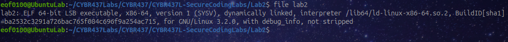

---

## Question 2: What are the files that make up this binary, and which one contains main?

The file that contains main is cscd437lab2main.c. The cybr437lab2.c contains functions used by main, cybr437lab2.h is a header file, and finally lab2 is a compiled executable.


---

## Question 3: What are the type(s) and name(s) of parameter(s) being passed to main?


The parameters passed to main are argc (int), and argv (pointer to char). Argc stores the number of command line arguments while argv stores the arguments themselves.

**GDB Command(s):**

```gdb
ptype main
```


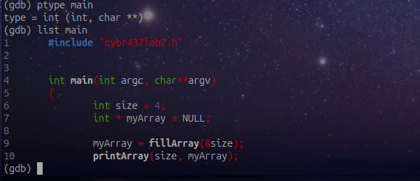

---

## Question 4: Set a breakpoint on each function and display the breakpoints.


**GDB Command(s):**

```gdb
info functions
break main
break cleanUp
break *fillArray
break printArray
info breakpoints
```


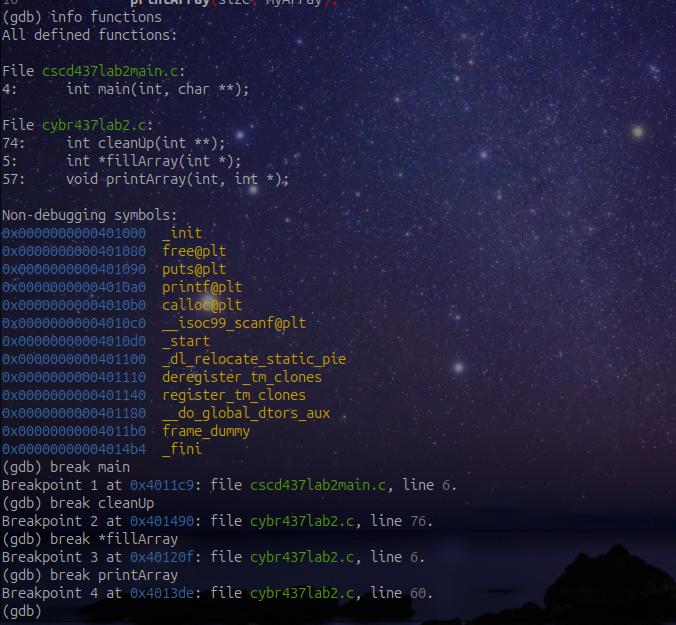

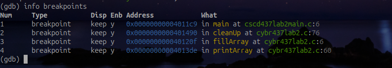


---

## Question 5: Begin running the program. How many arguments are passed to main?

One argument is passed argc = 1.


**GDB Command(s):**

```gdb
run
print argc
p argc
```


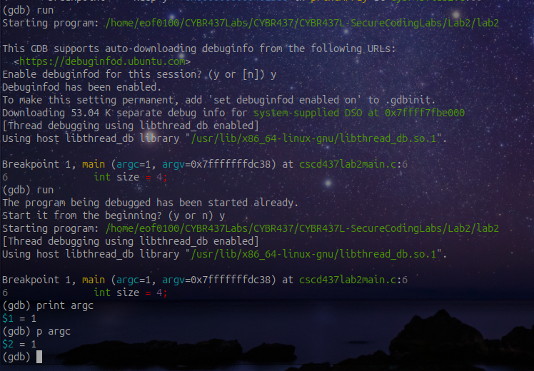

---

## Question 6: Step twice and display the contents of the constant and two variables in main.

**GDB Command(s):**

```gdb
print size
print myArray
print argc
```


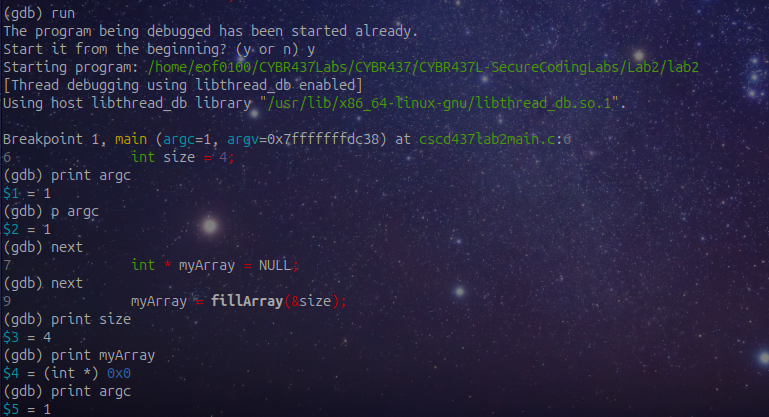

---

## Question 7: Step into the first function called in main. What is the type and name of the constant? Where is the constant declared?

The constant is called MAX and it is a const int type which is declared globally outside of fillArray function.

**GDB Command(s):**

```gdb
step
list
info locals
```


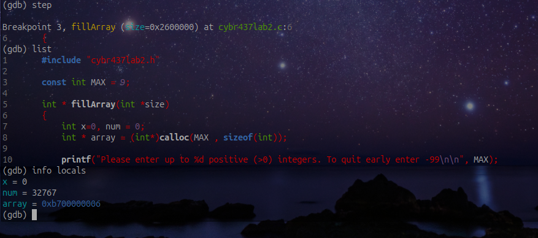

---

## Question 8: Explain the difference between printing `var` and `var[x]`.


Printing the array prints out the memory address stored at the pointer location but the array[x] prints out the actual value stored at index x.


---

## Question 9: Instead of continuing this function, return to main and print the current line.

I used bt to find fillArray which was at stack frame 11, then switched to it using frame 11 command, used return to return to main, then list . to display the current line.

**GDB Command(s):**

```gdb
bt
frame 11
return
list .
```


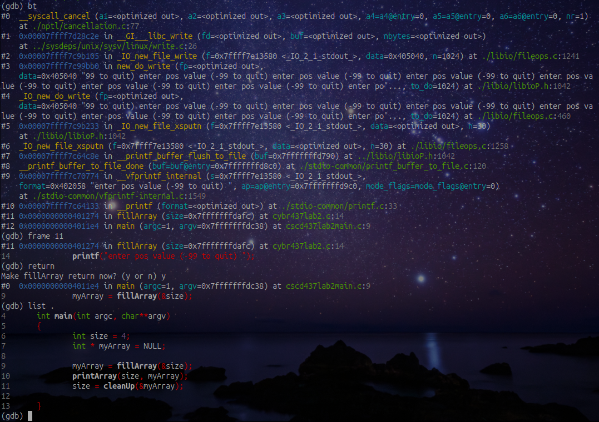

---

## Question 10: Step into the second function called from main. What is the name and starting value of the counting variable?

As you can see from the screenshot below the name of the starting value of the counting variable is called x and its starting value is 0.

**GDB Command(s):**

```gdb
next
step
info locals
print x
```


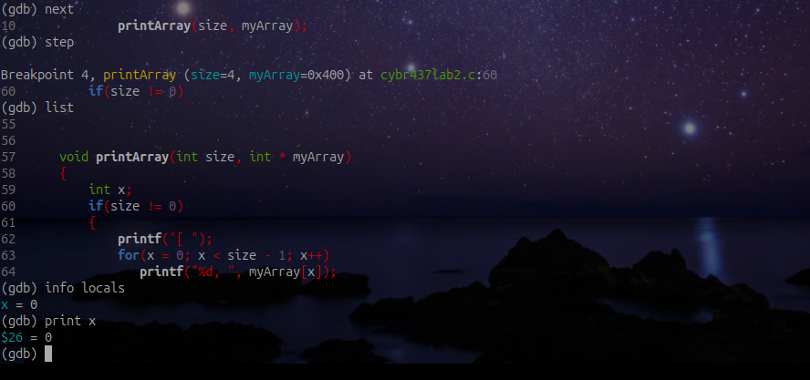

---

## Question 11: Use the disassemble command in GDB to display the assembly code for the function. What does the output show, and how does it correlate with the C source code?

he disassemble command shows the assembly instructions generated for the printArray() function. The assembly corresponds to the C code by showing instructions for the if statement, the for loop, accessing myArray[x], incrementing x, and calling printf().


The disassemble command shows assembly code for printArray() function. The assembly correlates to the C code by showing the instruction set for the if statement, for loop, accessing array at myArray[x], increasing x, and calling printf() statement. 

**GDB Command(s):**

```gdb
disassemble printArray
```


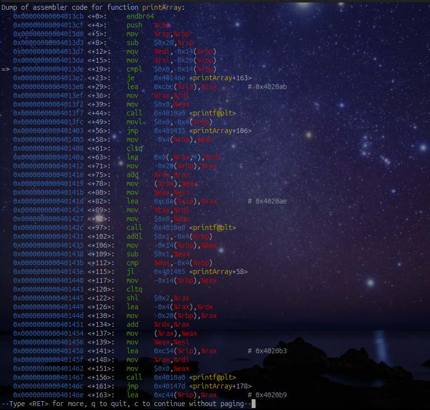

---

## Question 12: Delete the breakpoint for the first function called in main and disable the breakpoint for the last function called.

First, I used info breakpoints to view all of my breakpoints. The first function called in main is fillArray, so I deleted its breakpoint. The last function called in main is cleanUp, so I disabled its breakpoint. At first I accidentally deleted cleanUp but then I added it to the breakpoint then disabled it, finally, verifying everything is correct with info breakpoints.

**GDB Command(s):**

```gdb
info breakpoints
delete 2
delete 3
info breakpoints
break cleanUp
disable 5
info breakpoints
```


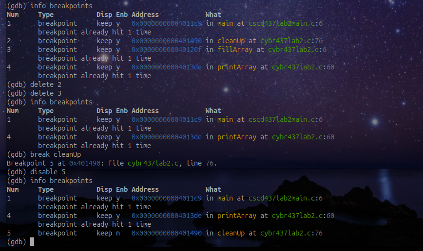

---

## Question 13: Without starting over, AKA your current location in a function that is not main, print the memory location of the first variable passed to main.

I used bt to find that main was in frame 1, switched to it using frame 1, and used print &argc to display the memory address of the first parameter passed to main.

Using bt command to find that main was located in frame 1, switched to frame 1, and then used &argc to display the memory address of the first parameter that is passed to main which was 0x7fffffffdaec.


**GDB Command(s):**

```gdb
bt
frame 1
print &argc
```


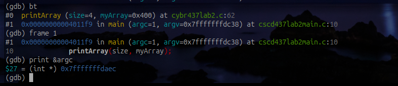

---

## Question 14: Print the information on the current running threads. How many threads are running?

I used info threads to display the active threads, and there was 1 thread running.

Using info threads command displayed active threads of 1 as shown from the screenshot below.

**GDB Command(s):**

```gdb
info threads
```


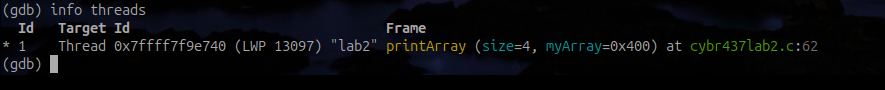

---

## Question 15: Enable the breakpoint for the third function called by main. What is the type, name, and memory location of the variable passed to it?

The var passed to cleanUp() function is myArray. Its type in int** and its memory location is 0x7fffffffdaf0.


**GDB Command(s):**

```gdb
info args
ptype myArray
print myArray
```


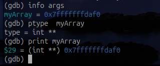

---
